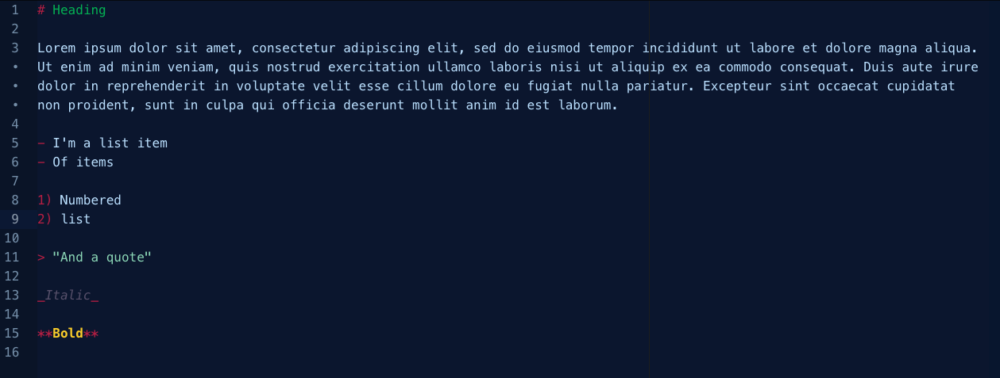
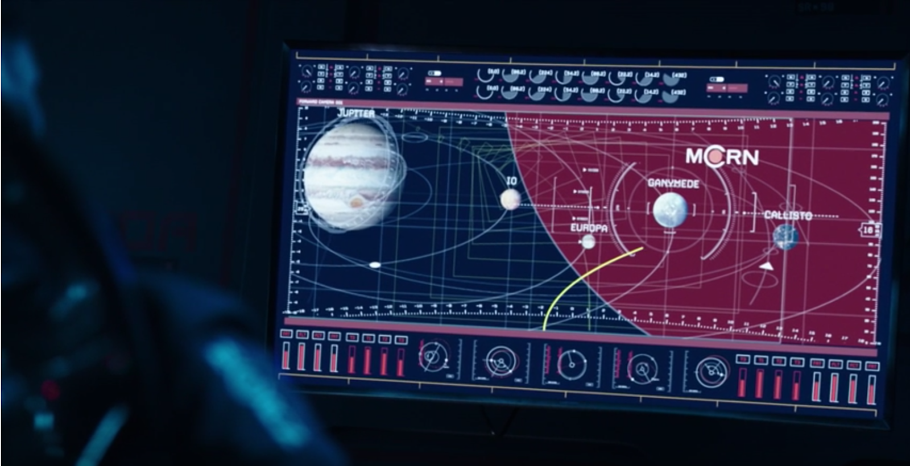

# Expanse Syntax for Atom

An Expanse themed syntax for writing Markdown in Atom. Works great with the [Expanse UI](https://atom.io/themes/expanse-ui).

Requires: [language-markdown](https://atom.io/packages/language-markdown) to be installed.

The insperation was taken from the following screen capture of the show:

This theme was derived from @[magnoliaceiling](https://github.com/magnoliaceiling) [dark-md-syntax](https://github.com/magnoliaceiling/dark-md-syntax) a great dark themed syntax for writing Markdown in Atom.
